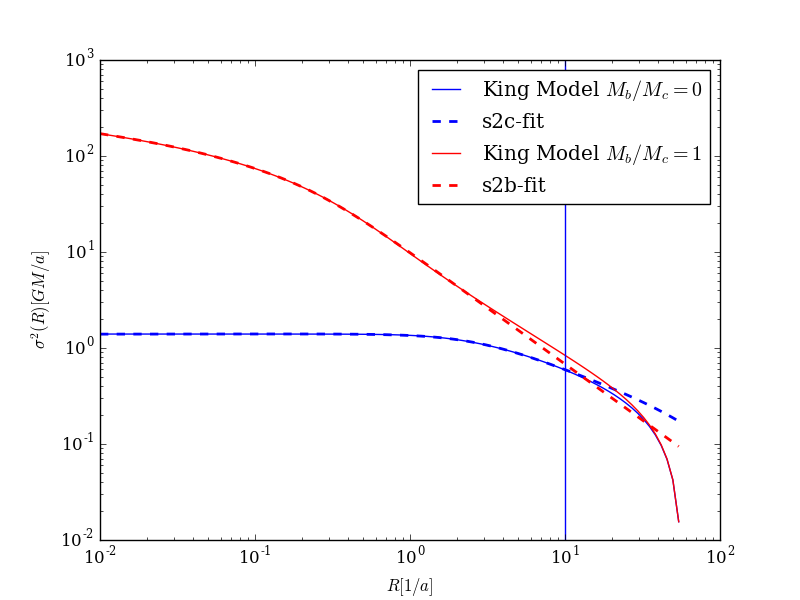
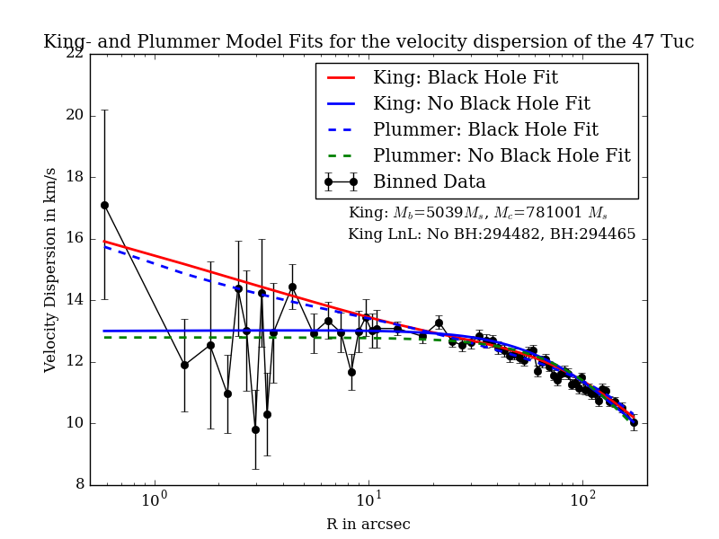

# King model 

king-model.py contains the binned and unbinned analysis using the king model.

fitfunc_params_xx.txt contain the parameters of the approximation function of the king model

king_params_xx.txt contain parameters of the max. likelihood fit.

approximation functions for the king model.

plot containing king and plummer fits. 

Masses (in solar Masses):

King: 

no black hole model:  Mc= 781001                lnL= 294482

black hole model:     Mc= 883980    Mbh= 5039   lnL= 294465

Plummer: 

no black hole model:   Mc= 695916               lnL= 246062

black hole model:      Mc= 859088   Mbh= 11700  lnL= 246041

note: since ln(likelihood)~ const - lnL , a smaller lnL value means a higher likelihood
